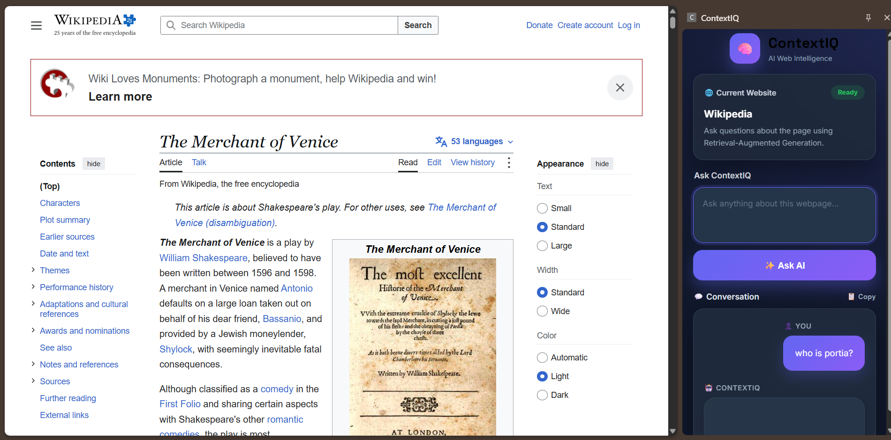

# 🚀 ContextIQ

>  An AI-powered Chrome Extension that enables users to ask questions about webpage content using Retrieval-Augmented Generation (RAG), with PDF question answering currently under development.


---

## 📌 Overview

ContextIQ is an intelligent Chrome Extension that transforms webpage content into an interactive AI knowledge assistant, with PDF question answering currently under development.

Instead of manually searching through lengthy content, users can simply ask questions in natural language and receive context-aware answers powered by Retrieval-Augmented Generation (RAG).

The extension extracts webpage content, creates semantic embeddings, stores them in a FAISS vector database, retrieves the most relevant information, and generates context-aware responses using Groq's GPT-OSS 120B model.

---

## ✨ Features

- 🌐 Ask questions about supported webpages
- 📌 Chrome Side Panel interface
- 🕘 Persistent question history
- 📄 PDF question answering *(under development)*
- 🧠 Retrieval-Augmented Generation (RAG)
- ⚡ Fast semantic search using FAISS
- 🤖 Powered by Groq GPT-OSS 120B
- 🔍 Context-aware responses
- 💬 Conversational chat interface
- 📚 Session-based memory
- 🔎 Web search support using DuckDuckGo
- 🚀 FastAPI backend
- 🧩 Chrome Extension (Manifest V3)

---

## 🏗️ Project Architecture

```
                ┌──────────────────────┐
                │  Chrome Side Panel   │
                └──────────┬───────────┘
                           │
                           ▼
               Extract Webpage Content
                           │
                           ▼
                Text Chunking (LangChain)
                           │
                           ▼
                HuggingFace Embeddings
                           │
                           ▼
                  FAISS Vector Store
                           │
                           ▼
                Relevant Context Search
                           │
                           ▼
                   GROQ GPT-OSS 120B
                           │
                ┌──────────┴──────────┐
                │                     │
          Context Answer       Web Search Fallback
                │                     │
                └──────────┬──────────┘
                           ▼
                  AI Generated Response

```

---

## 🛠️ Tech Stack

### Frontend

- HTML5
- CSS3
- JavaScript (ES6)
- Chrome Extension Manifest V3

### Backend

- Python
- FastAPI
- Uvicorn

### AI & RAG

- LangChain
- Groq API
- GPT-OSS 120B
- HuggingFace Embeddings
- Sentence Transformers
- FAISS Vector Store
- DuckDuckGo Search

### PDF Processing

- PyMuPDF

---

## 📂 Project Structure

```
ContextIQ
│
├── backend
│   ├── main.py
│   ├── requirements.txt
│   ├── render.yaml
│   └── ...
│
├── extension
│   ├── manifest.json
│   ├── popup.html
│   ├── popup.css
│   ├── popup.js
│   ├── background.js
│   ├── content.js
│   ├── researchMode.js
│   ├── icon.jpg
│   └── pdfjs/
│
└── README.md
```

---

## ⚙️ Installation

### 1. Clone Repository

```bash
git clone https://github.com/RjAbhishek185/ContextIQ.git
cd ContextIQ
```

---

### 2. Backend Setup

```bash
cd backend

python -m venv venv

# Windows PowerShell
Set-ExecutionPolicy -Scope Process -ExecutionPolicy Bypass
.\venv\Scripts\Activate.ps1
(.\venv\Scripts\python.exe -m uvicorn main:app --host 127.0.0.1 --port 8000)

# macOS/Linux
source venv/bin/activate

pip install -r requirements.txt
```

Create a `.env` file:

```env
GROQ_API_KEY=your_api_key_here
```
> **Security:** Never commit your `.env` file or expose your API key publicly. The `.env` file is included in `.gitignore`.


Run the backend:

```bash
uvicorn main:app --reload
```

Backend runs on:

```
http://127.0.0.1:8000
```

FastAPI interactive documentation:

```
http://127.0.0.1:8000/docs
```

---

### 3. Load Chrome Extension

Open Chrome:

```
chrome://extensions
```

- Enable **Developer Mode**
- Click **Load unpacked**
- Select the `extension` folder

---

## 🚀 How It Works

1. User opens a webpage.
2. The Chrome Extension extracts the available webpage content.
3. Content is sent to the FastAPI backend.
4. LangChain splits the content into chunks.
5. HuggingFace generates semantic embeddings.
6. FAISS retrieves the most relevant context.
7. Groq GPT-OSS 120B generates a context-aware answer.
8. The response is displayed inside the extension.

> **PDF Support:** PDF question answering is currently under development. The project includes PDF processing components, and PDF extraction, retrieval, and question-answering support are being actively improved.

---

## 📸 Demo

### 1. Ask Questions About Any Webpage

ContextIQ detects the current website and allows users to ask natural-language questions about its content.



### 2. Context-Aware AI Answer with Retrieved Sources

ContextIQ retrieves relevant webpage content using semantic search and uses the retrieved context to generate an answer.


> **PDF Support:** PDF question answering is currently under development and is planned as a future extension of the existing RAG pipeline.

---

## 🔮 Roadmap

- [ ] Complete PDF question answering
- [ ] Improve PDF text extraction and processing
- [ ] Multi-document chat
- [ ] Research Mode
- [ ] Citation support
- [ ] Improve streaming response experience
- [ ] Dark / Light themes
- [ ] Chrome Web Store release
- [ ] Backend deployment optimization
- [ ] Export conversations
- [ ] OCR support for scanned PDFs

---

## 🎯 Future Improvements

- Support for additional LLM providers
- Image understanding
- Local embedding models
- Hybrid semantic search
- Cross-document reasoning
- Team workspaces
- Cloud synchronization

---

## 🤝 Contributing

Contributions are welcome.

1. Fork the repository
2. Create a feature branch
3. Commit your changes
4. Open a Pull Request

---


## 👨‍💻 Author

**Abhishek Raj**

- GitHub: https://github.com/RjAbhishek185
- LinkedIn: https://www.linkedin.com/in/abhishek-raj-1589a62a1/

---

⭐ If you found this project helpful, consider giving it a star!
